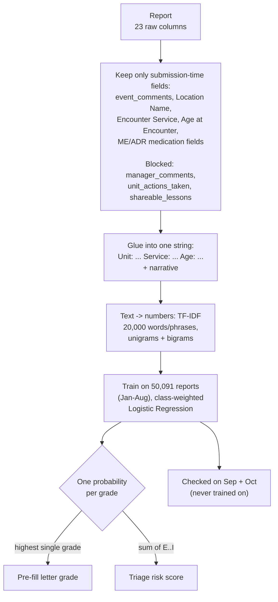
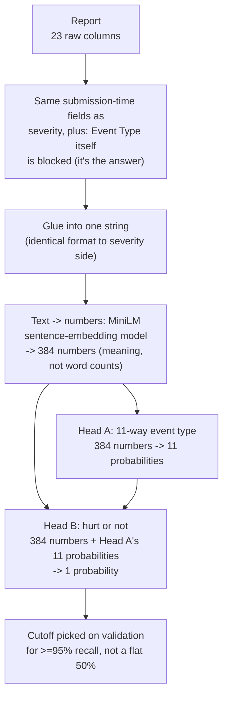

# Pipeline architecture

Two separate pipelines, built by two people, answering two different
questions from the sponsor's requirements. They never share a model — they
combine only at the very end, in the final per-report record.

- **Severity** ("how bad is this report") — this repo.
- **Event type** ("what kind of report is it") — the teammate's `11-buckets`
  repo, answering the sponsor's "group reports into recurring safety themes"
  requirement.

---

## Severity pipeline



### Example, end to end

Input fields:

```
Unit: ICU. Service: Cardiology. Age: 74. Prescribed: Warfarin 5mg.
Patient found on floor at 0300, alert and oriented, complaining of
left hip pain. X-ray confirmed fracture. Transferred to OR for repair.
```

TF-IDF, current production code (`severity_model.py`; the retired
`baseline_grader.py`/`ordinal_vs_coarse.py` use the same shape without the
`token_pattern` fix below, since they predate it):

```python
TfidfVectorizer(
    stop_words="english", max_features=20000, ngram_range=(1, 2), min_df=3,
    token_pattern=r"(?u)\b[\w-]+\b",  # keeps hyphenated terms like "X-ray" intact
)
LogisticRegression(max_iter=1000, class_weight="balanced", n_jobs=-1)
```

Actual output from the current retrained model on this exact report (not
illustrative -- run through `severity_model/model.joblib`):
`A:3% B1:5% B2:6% C:15% D:9% E:36% F:18% G:5% H:1% I:1%`
→ pre-fill = **E** (highest), triage score = **61%** (sum of E through I).

### The three branches that exist in the code today

All three start from the identical steps above (columns → glue → TF-IDF).
They differ only in what "correct answer" column each one is trained
against. They are three separate trained models, not one pipeline with
three outputs.

| Branch | Script | Trained against | Why it exists |
|---|---|---|---|
| 1 — 3 buckets | `baseline_grader.py` | `none` / `some` / `serious` | Original version of this project |
| 2 — 10 grades | `ordinal_vs_coarse.py` | `A, B1, B2, C, D, E, F, G, H, I` | Sponsor needs the real PSRS letter, not a bucket |
| 3 — binary | `ordinal_vs_coarse.py` | `hurt` / `not hurt` | Built once, only to check whether Branch 2's derived triage score is as good as a model built just for triage. Not a production model. |

**Decision: Branch 2 is the one to keep — done, 2026-09-24.** `severity_model.py`
is the finished version: trains the 10-grade model, derives the letter grade,
the 3-bucket label (sum A+B1+B2+C+D / E+F / G+H+I), and the triage score all
from one model, picks a triage cutoff on validation for this project's own
default target of >=95% recall (not a documented sponsor requirement),
calibrates the triage probability (Platt scaling, to correct for training
data oversampling harm relative to the real rate), and
saves everything to `severity_model/` (`vectorizer.joblib`, `model.joblib`,
`calibrator.joblib`, `config.json`, `evaluation.json`). `baseline_grader.py`
(Branch 1) and the standalone binary model in `ordinal_vs_coarse.py`
(Branch 3) are both superseded -- kept in the repo for history, not run
going forward.

### Results, October test set (8,312 reports)

**Branch 1 — 3 buckets:**

| Bucket | Precision | Recall |
|---|---|---|
| none | 0.99 | 0.96 |
| some | 0.55 | 0.89 |
| serious | 0.55 | 0.80 |

Accuracy 96%, macro F1 0.77.

**Branch 2 — 10 grades** (all numbers below read directly from
`severity_model/evaluation.json`, current as of the round-4 retrain --
this table and the "Final, saved model" section below are the pipeline's
canonical numbers; the Severity Model Reference doc mirrors them):

| Grade | Precision | Recall | Test rows |
|---|---|---|---|
| A | 0.45 | 0.68 | 442 |
| B1 | 0.15 | 0.34 | 47 |
| B2 | 0.75 | 0.81 | 1,505 |
| C | 0.77 | 0.70 | 2,487 |
| D | 0.89 | 0.81 | 3,428 |
| E | 0.58 | 0.84 | 318 |
| F | 0.65 | 0.86 | 65 |
| G | 0.60 | 0.50 | 6 |
| H | 0.72 | 0.93 | 14 |
| I | — | — | 0 (no test cases at all) |

| | This model | Guess-most-common-grade |
|---|---|---|
| Exact-letter accuracy | 76.6% | 41.2% |
| Mean grade-distance error | 0.39 | 0.95 |
| Quadratic-weighted kappa | 0.72 | 0.00 |

### Final, saved model (`severity_model.py`) — closed out 2026-09-24

**3-bucket, derived from the 10-grade model** (replaces Branch 1 outright):

| Bucket | Precision | Recall | F1 |
|---|---|---|---|
| none | 0.99 | 0.99 | 0.99 |
| some | 0.76 | 0.83 | 0.79 |
| serious | 0.62 | 0.75 | 0.68 |

**Honest trade-off vs. the original Branch 1 model** (which trained directly
on 3 buckets, no letter grade): precision on `some`/`serious` went up a lot
(0.55 → 0.76 / 0.62), but recall went down (`some` 0.89 → 0.83, `serious`
0.80 → 0.75). This project's default priority is high sensitivity even at
the cost of precision — so a straight argmax over the derived buckets is
*not* automatically the right cutoff to use if the 3-bucket label itself is
still shown to reviewers. The **calibrated triage score below is the
answer to that priority**, tuned explicitly for recall; the 3-bucket label
is a secondary, human-readable summary, not the flagging mechanism.

**Triage cutoff, picked on validation only for >=95% recall, frozen and
applied to test:**

| | Value |
|---|---|
| Cutoff (raw triage score) | 0.2361 |
| Recall achieved on validation | 95.2% |
| Recall on test (untouched, same cutoff) | **96.0%** |
| Precision on test | 28.9% |
| Share of all test reports flagged | 16.1% |
| AUPRC (cutoff-independent ranking quality) | 0.871 |

28.9% precision at 96.0% recall is the honest cost of this project's own
default priority: catching nearly all real harm means accepting that roughly
3 in 4 flagged reports won't turn out to be harmful. That's an explicit,
measured trade-off now, not a guess. See the Severity Model Reference §14.2
for the fuller operating-point menu, including the trade-off for catching
every "serious" case specifically.

**Calibration** (Platt scaling on validation, to correct for the training
set's oversampled harm rate vs. the real rate in val/test): Brier score
0.031 (raw) → 0.014 (calibrated) — the calibrated probability is
meaningfully more trustworthy as an actual risk percentage, not just a
ranking signal.

**Known gap, not fixable by modeling:** `I` (death) has zero test-set rows;
`G` (permanent harm) has 6. No model can be validated on death cases with
this split — worth raising with the sponsor directly.

**Saved artifacts:** `severity_model/vectorizer.joblib`, `model.joblib`,
`calibrator.joblib`, `config.json` (the frozen cutoff), `evaluation.json`
(this whole report, machine-readable). Verified end to end: reloading these
four files from disk and predicting on a new report (not used in training)
reproduces the expected grade, bucket, and flag decision.

### Sponsor-facing review, round 1 (2026-09-25)

A detailed review raised six concrete gaps, addressed as far as possible
without sponsor input. `leakage_inflation_check.py`, `severity_model_extended.py`,
and `prefill_extra_fields.py` were added; `data_pipeline.py` now handles a
`Deleted` harm score gracefully and cites the sponsor's own code for the
B1-before-B2 grade ordering.

### Sponsor-facing review, round 2 (2026-09-25) — two factual corrections, several bugs found and fixed

The round-1 writeup had real errors, caught in a second review:

- **Wrong sponsor number.** The sponsor reported 95.2% sensitivity at 96.0%
  specificity, not "96% recall." Corrected comparison at matching
  specificity: this model gets 90.3% sensitivity at 96.0% specificity,
  trailing their reported number. AUROC 0.986 added as the threshold-free
  comparison point.
- **"No access to their code" was disputed, then re-confirmed as still true.**
  A review claimed their training script was "attached earlier in this
  conversation" -- it was not; no such file exists anywhere in this
  project's history. The scorecard now says the head-to-head is blocked on
  the script itself, not compute, and will be revisited if that script is
  ever actually shared.
- **Tokenizer bug, fixed, model retrained.** scikit-learn's default token
  pattern dropped single characters, so "X-ray" tokenized to "ray" --
  wrong in every downstream explanation, not just the demo. Fixed
  (`token_pattern=r"(?u)\b[\w-]+\b"`) and the production model, the leakage
  check, and all evaluations retrained/rerun on the corrected vectorizer.
- **Recall@k was structurally misleading.** Pooled over the full 31-day test
  set, "top 20 catches 5%" looked bad but meant nothing -- recomputed per
  day and averaged: top 20 catches 89.3%, top 50 catches 97.1% of each
  day's harm cases. A completely different, correct number.
- **Subgroup table now carries n_pos and Wilson 95% confidence intervals** --
  the earlier version's "Obstetrics: 0.769 recall" looked like a finding;
  with intervals shown, every service's recall interval overlaps every
  other's. No confirmed subgroup disparity survives. Subgroup membership was
  also generator-assigned, not real -- the analysis that counts is the one
  on the real container run.
- **Report Type is very likely circular with the harm label.** "Serious
  Event" agrees with the true hurt (E-I) label 99.3% of the time. If this
  field is set after review (plausible given that correlation), pre-filling
  it from a model has the same circularity the original leakage bug had.
  Needs sponsor confirmation -- open question, not resolved here.
- **Leakage-effect claim narrowed.** AUPRC/AUROC deltas from adding the two
  blocked fields are near zero on this synthetic dataset -- the finding is
  now stated as "little effect here," not extrapolated to the sponsor's real
  data, where manager comments likely carry more signal.

Full writeup, all numbers, and the automation-bias mitigation plan: see the
Severity Model Reference doc (ask for the link if you don't have it).

**Not yet done:** committing and tagging the commit that produced the
evaluation JSONs -- needed for these numbers to be reproducible, but a
deliberate choice left to you, not done automatically.

### Sponsor-facing review, round 3 (2026-09-25) -- the script exists, and it confirms leakage

Round 2's "no such file exists anywhere in this project's history" was true
of the conversation history, but wrong about the filesystem: the script was
sitting in `~/Downloads/Capstone Engineering Files/`. Reading it changed two
things and fixed the doc's remaining stale numbers:

- **Their script confirms leakage directly -- no synthetic-data proxy needed
  for this part.** `LLM_fine_tuning_MIDA_PSRS_score_Weights_clean.py`
  (`yikuan8/Clinical-Longformer`, 4096-token max length) builds its model
  input with a function that includes `MANAGER COMMENTS` and
  `UNIT_ACTIONS_TAKEN` verbatim -- the same two post-investigation fields
  this pipeline excludes by design. That's a fact about their code, not an
  inference. Their split is also random-stratified, not date-based, which is
  a second reason their number and this model's number aren't directly
  comparable. The scorecard now reads "pending GPU run," not "blocked" --
  next step is training their script twice on a Colab T4 (once as written,
  once with those two fields stripped) to size the effect on real data.
- **The two systematic "serious" misses got pulled and read, not just
  counted.** Across every recall target tested, the same 1-2 of the test
  set's 20 G/H/I cases are missed regardless of cutoff
  (`SYNPROD-TEST-0006980`, true grade H, score 0.208; `SYNPROD-TEST-0009928`,
  true grade G, score 0.152). Both reports narrate the moment of discovery
  ("could have received an incorrect... dose," "patient looked fine and was
  talking normally") -- the eventual G/H severity was determined later, by a
  reviewer who knew the outcome, using information this text field never
  contained. No threshold change fixes this; it's a hard floor on what
  text-only triage can catch for this report shape, and it's now stated as
  the headline of that section, not a footnote below the operating-point
  table.
- **Stale numbers from the pre-retrain model, fixed.** The doc's §8/§10/§11
  tables still showed the pre-tokenizer-fix numbers (96.8% recall, 27.5%
  precision, 76.7% accuracy, cutoff 0.225, 17.0% flag rate) even though §14
  already had the retrained ones. All now read from `evaluation.json`
  directly: 96.0% recall, 28.9% precision, 76.6% accuracy, cutoff 0.2361,
  16.1% flag rate.
- **Cross-reference fixed:** §12's prior-shift pointer now says §14.4, not
  §14.3 (an earlier renumbering had drifted).
- **Revision-history language stripped from the sponsor-facing doc itself**
  (the "first version over-claimed" / "built across two rounds of review"
  framing). That belongs here, not in front of the sponsor -- their copy now
  states current findings only, keeping bug notes (tokenizer fix, Laplace
  smoothing) only where they explain a design choice.

**Bottom line:** the round-2 "Bottom line" is met. The only work still
genuinely open is the GPU rerun of their actual script (now unblocked,
just not yet done), the archetype-overlap check (needs sponsor-provided
IDs), and the Report Type intake-vs-post-review question (needs a sponsor
answer, not resolvable from either script).

### Sponsor-facing review, round 4 (2026-09-25) -- the missed-cases fix, and stale numbers that survived two rounds

Round 3's headline claim was wrong, caught before it shipped:

- **"No threshold change fixes this" was false.** The two lowest-scoring
  missed G/H cases score 0.208 and 0.152 -- a cutoff of ~0.152 catches both,
  plus a third case (`SYNPROD-TEST-0001789`, grade G, score 0.310) that's
  also missed at every recall target below 95%. Catching all 20 serious
  cases in the test set costs a flag rate of 28.9% (vs. 16.1% today) --
  roughly 25 more false alarms/day at the sponsor's stated volume. Added as
  an explicit row in the operating-point menu (§14.2) instead of asserting
  the trade-off doesn't exist. That's the sponsor's call, not this
  pipeline's to make silently.
- **The "reviewer knew the outcome later" explanation was a guess presented
  as fact.** Nobody verified it. These are LLM-written synthetic narratives
  generated from an archetype and a label -- "patient looked fine, talking
  normally" paired with permanent harm is at least as likely to be generator
  label noise as a real delayed-harm pattern. Both hypotheses are now stated
  side by side, with a concrete question for the Safety Officer shadowing
  session: do real G/H reports ever read like a caught near-miss at intake?
- **A cleaner fix than reopening leakage, added:** re-triage on update.
  Manager comments are illegitimate for initial triage but perfectly
  legitimate once they actually exist -- a report that scored low at intake
  and later gets a worrying manager comment gets re-scored and re-flagged at
  that point. Real feature, not leakage, and it directly targets this
  failure mode.
- **§3's TF-IDF snippet was missing the token_pattern fix** -- code shown
  didn't match the code that actually ran. Fixed.
- **§11's per-grade and 3-bucket tables were carried over from the
  pre-retrain model**, identical to two decimals even after accuracy moved
  in round 3. Recomputed directly from `evaluation.json`: B1 recall
  0.32->0.34, E recall 0.85->0.84, F precision/recall 0.62/0.85->0.65/0.86,
  H precision 0.81->0.72, MAE 0.40->0.39, kappa 0.71->0.72, serious-bucket
  precision/F1 0.65/0.70->0.62/0.68.
- **§14.9 had a note to me, not the sponsor** ("this is the user's call to
  make") -- removed; the section now just states that the evaluation JSONs
  are committed and tagged.
- **§14.1 reframed.** "Confirmed leakage in their pipeline" was accurate but
  is the sponsor's own code -- raised verbally at the weekly meeting first,
  and the doc now reads "their script includes two post-review fields as
  input; we'll measure the effect." Also added the point round 3 missed
  entirely: their 95.2%/96.0% was measured on the real CY2024 Excel export.
  A Colab rerun here can only run on the synthetic dataset, so it measures
  the leakage effect on synthetic data for Longformer -- it cannot reproduce
  or refute their real-data number. Only someone with access to the real
  data can actually test that number.

**Heads-up for whoever runs the Colab rerun:** their script will likely
break as-is on current `transformers` -- `compute_loss` needs a
`num_items_in_batch=None` kwarg (4.46+), `evaluation_strategy` is now
`eval_strategy`, and `tokenizer=` in `Trainer(...)` is now
`processing_class=`. Also, their `make_report()` writes the literal string
`"nan"` into the text for empty fields (via unguarded f-string formatting of
`NaN` floats) -- harmless, but this pipeline's `build_input_text` doesn't do
that, so note the difference if scores are compared field-for-field.

Committed and tagged tonight per the round-4 review's instruction --
`severity_model/evaluation.json` and `extended_evaluation.json` are pinned
to the commit that produced them.

---

## Event-type pipeline (teammate's `11-buckets` repo)



Code shape (`sentence-transformers`):

```python
SentenceTransformer("all-MiniLM-L6-v2")
model.encode(text)  # -> 384 numbers
```

Both heads trained together, 5 random seeds, one combined loss (event-type
loss + hurt loss).

### Results (teammate's README; independently spot-checked, see below)

| Metric | Value |
|---|---|
| Event-type accuracy (11-way) | 87.3% |
| Hurt recall (with event-type hint) | 95.7% ± 1.3% |
| Hurt precision (with hint) | 8.1% ± 0.3% |
| Hurt PR-AUC (with hint) | 0.472 ± 0.011 |
| Hurt PR-AUC (ablation, no hint) | 0.466 ± 0.005 |

Their own finding: the event-type hint barely moves PR-AUC (0.466 → 0.472).

**Independently verified:** rebuilt this exact architecture and ran it on our
own data as a sanity check (`combined_mtl.py`) — got 83.1% event-type
accuracy, close enough to their 87.3% to confirm the approach works, without
touching their actual codebase.

### Tested and rejected: merging the two pipelines

We tried feeding Head A's category hint into a severity prediction directly
(the same hint pattern, transplanted onto this repo's task). It made severity
worse, not better — macro F1 dropped from 0.77 to 0.45, with no benefit from
the hint. Full results: `combined_mtl_results.json`. The two pipelines stay
separate because of this result, not by default.

---

## Where the two pipelines meet

Never inside a model — only in the final combined record per report:

| | Severity (this repo) | Event type (teammate's repo) |
|---|---|---|
| Example report above | Grade F, hospitalization added | Fall, hurt = yes (91%) |
| Feeds | Pre-fill + triage worklist | Recurring-theme tracking |
